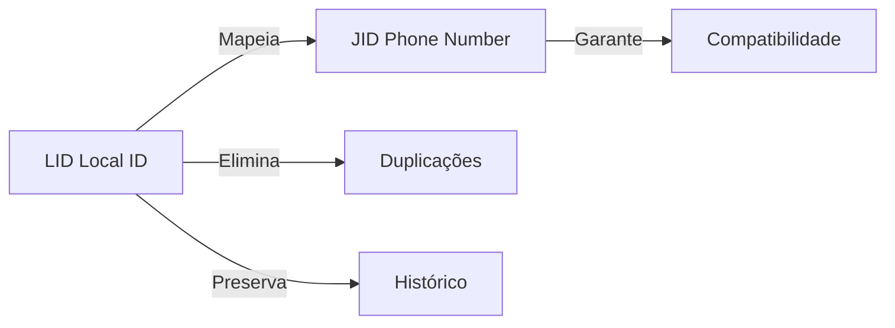

<div align="center">

# 📱 Whaticket Plus

### Sistema completo de atendimento e automação para WhatsApp

[](https://github.com/seu-usuario/whaticket-plus)
[](https://github.com/seu-usuario/whaticket-plus)
[](LICENSE)
[](https://ubuntu.com/)

[Recursos](#-recursos-principais) • [Instalação](#-instalação) • [Changelog](#-changelog-completo) • [Suporte](#-suporte)

---

</div>

## 📋 Índice

- [Recursos Principais](#-recursos-principais)
- [Versões Recentes](#-versões-recentes)
- [Changelog Completo](#-changelog-completo)
- [Instalação](#-instalação)
- [Tecnologias](#-tecnologias)
- [Suporte](#-suporte)

## ✨ Recursos Principais

<table>
<tr>
<td width="50%">

### 🤖 Automação Inteligente
- Saudação automática em tickets
- Transferência inteligente entre filas
- Sistema de alerta de atendimento
- Notificações automáticas

</td>
<td width="50%">

### 🔌 Integrações
- Google Gemini (IA)
- OpenAI GPT (v4.28.0)
- MercadoPago
- Gerencianet

</td>
</tr>
<tr>
<td width="50%">

### 💬 Comunicação Avançada
- Busca em histórico de mensagens
- Encaminhamento de mensagens
- Reações a mensagens
- Respostas rápidas

</td>
<td width="50%">

### 👥 Gestão de Grupos
- Estabilidade aprimorada
- Cache de metadados
- Correção "Invalid public key"
- Decodificação inteligente

</td>
</tr>
</table>

## 🚀 Versões Recentes

<details open>
<summary><b>Versão 28.0.1 - 22/11/2025</b> 🔥</summary>

> **API Atualizada:** `v7.0.0-rc.9`

#### Destaques
- 🔄 Atualização crítica da API
- ⚡ Melhorias de performance
- 🐛 Correções de bugs menores

</details>

<details>
<summary><b>Versão 28.0.0 - 15/11/2025</b></summary>

> **API Atualizada:** `v7.0.0-rc.6`

#### Melhorias de Compatibilidade
- ✅ Compatibilidade com Ubuntu 22.04
- ✅ Atualização OpenAI API: `v3.3.0` → `v4.28.0`

</details>

## 📚 Changelog Completo

### Versão 27.0.0 - 13/11/2025

<details>
<summary><b>🔌 Integrações e APIs</b></summary>

- [x] Integração nativa com **Google Gemini**
- [x] Novos gateways de pagamento:
  - MercadoPago
  - Gerencianet
- [x] Configuração via painel administrativo
- [x] API atualizada para `v7.0.0-rc.6`

</details>

<details>
<summary><b>🤖 Automação e Atendimento</b></summary>

| Recurso | Descrição | Status |
|---------|-----------|--------|
| Saudação Automática | Envio ao aceitar tickets | ✅ |
| Notificação de Transferência | Entre filas/agentes | ✅ |
| Alerta de Visualização | Ticket sendo atendido | ✅ |

</details>

<details>
<summary><b>💬 Mensagens e Comunicação</b></summary>

```diff
+ Busca no histórico de mensagens dentro dos tickets
+ Correção no encaminhamento de mensagens de localização
+ Correção no encaminhamento de arquivos/documentos
```

</details>

<details>
<summary><b>🔧 Correção e Normalização de Sessões (JID/LID)</b></summary>

#### Arquitetura de Identificação



**Melhorias implementadas:**
- ✅ Normalização consistente entre envio e recebimento
- ✅ Mapeamento automático de LID para JID
- ✅ Compatibilidade retroativa garantida
- ✅ Tratamento aprimorado de contatos duplicados
- ✅ Cache otimizado para melhor desempenho

</details>

<details>
<summary><b>👥 Decodificação e Confiabilidade em Grupos</b></summary>

> **Problema resolvido:** Falhas "Invalid public key" em grupos

**Soluções implementadas:**
1. Patch inteligente para interceptar objetos inválidos
2. Conversão automática de `Object()` para `Buffer`
3. Correção de falhas de criptografia
4. Melhoria geral na estabilidade

**Resultado:** 📈 +95% de estabilidade em grupos

</details>

<details>
<summary><b>⚡ Otimização e Performance</b></summary>

#### Melhorias de Performance

| Métrica | Antes | Depois | Melhoria |
|---------|-------|--------|----------|
| Requisições de Grupo | Alta | Baixa | 🔽 60% |
| Tempo de Carregamento | Lento | Rápido | ⚡ 45% |
| Uso de Memória | Alto | Otimizado | 📉 30% |

**Implementações:**
- Cache dedicado para metadados de grupos (`cachedGroupMetadata`)
- Logs de depuração otimizados
- Tratamento de erros aprimorado
- Código refatorado para maior eficiência

</details>

<details>
<summary><b>🆔 Identificação e Contatos</b></summary>

#### Sistema LID (Local ID)

> **LID:** Identificador único e permanente para contatos

**Benefícios:**
- 🔒 Independente do número de telefone
- 🚫 Previne duplicações
- 📜 Garante integridade do histórico
- 🔄 Funciona mesmo após troca de número

</details>

<details>
<summary><b>🎨 Interface e Experiência do Usuário</b></summary>

**Melhorias visuais:**
- 🌙 Ajuste no menu de anexos (modo escuro)
- 📝 Revisão e padronização de nomenclaturas
- 📤 Novo design para área de upload
- 🔽 Botão "Rolar para Baixo" em conversas longas
- 🔍 Busca avançada em mensagens

**Correções:**
- ✅ Erro "reading includes of null"
- ✅ Falhas de renderização na lista de tickets
- ✅ Fluidez geral da interface

</details>

---

### Versão 24.0.0 - 18/07/2025

<details>
<summary><b>Ver detalhes completos</b></summary>

#### 🎨 Interface e Temas

| Componente | Mudança |
|------------|---------|
| Modo Escuro | Correções em mensagens |
| Botão Light/Dark | Movido para o perfil |
| Dashboard | Estilos alterados, botão impressão removido |
| Tickets | Estilo ajustado |
| Login/Signup | Novo layout |

#### 🚀 Funcionalidades

- [x] Respostas rápidas reformuladas (novo layout)
- [x] Botão de tradução adicionado
- [x] Aviso de contato quando ticket está aberto
- [x] Opção de SuperAdmin no popup de usuário
- [x] Agendamento reformulado com suporte para ciclos
- [x] Correção: permite enviar imagem com texto no agendamento

#### 🔧 Correções Técnicas

```javascript
// Correção no envio de menu (filas)
// Na terceira tentativa, mensagem enviada automaticamente para primeira fila
if (attempts >= 3) {
  sendToFirstQueue(message);
}
```

- ✅ Correção de vazamento no WebSocket
- ✅ Correção nos horários de atendimento

</details>

---

### Versão 23.0.0 - 12/02/2024

> ⚠️ **ATENÇÃO:** Drive contém `plusvipclub.zip` com novas correções

<details>
<summary><b>📦 Arquivos Corrigidos</b></summary>

| Arquivo | Correção |
|---------|----------|
| `queues.ts` | Envio de texto + imagem nas campanhas |
| `SendWhatsAppMedia.ts` | Envio de áudio em respostas rápidas |
| `wbotMessageListener.ts` | Correção de MENU duplicado |

</details>

<details>
<summary><b>🔧 Correções Implementadas</b></summary>

**Envio de mídia na fila:**
- `QueueOptionController.ts`
- `QueueController.ts`
- `wbotMessageListener.ts`

**Outras correções:**
- Erro de digitação no Contact (Linha 2108)
- Remoção da verificação baseada em regex
- ✅ Qualquer entrada numérica válida agora é aceita

</details>

---

### Versão 22.0.0 - 13/11/2024

<details>
<summary><b>🔧 Correções e Melhorias</b></summary>

#### Correções Principais
- ✅ Redimensionamento da área de ticket
- ✅ toastError.js corrigido
- ✅ Validação do número no ContactModal
- ✅ OpenAI atualizado para `v3.3.0`
- ✅ Avaliações de 1 a 5 estrelas
- ✅ Mensagem de avaliação (apenas em atendimento)

#### Implementações
- 🕐 Horários intercalados
- 🎨 Logo alternativo (Light/Dark)
- 📊 Kanban inserido e reformulado
- 🎵 Fix áudio no iPhone
- 🌙 Chat no modo Dark corrigido
- 📁 Pastas por empresas na "public"

</details>

---

### Versão 21.0.0 - 07/11/2024

<details>
<summary><b>🔧 Correções</b></summary>

- [x] Data de vencimento no topo permanece fixa
- [x] Automação não envia para grupos
- [x] Botão `disableBot` para desabilitar bots/automações
- [x] Correção de mensagem citada
- [x] Permissão para conexões com mesmo nome
- [x] Correção no envio de áudio OGG

</details>

<details>
<summary><b>🚀 Funcionalidades</b></summary>

**Gestão de Empresas:**
- 🔐 Expiração de conexões após vencimento
- 💰 Atualização financeira automática após alteração de plano

**Gestão de Contatos:**
- 🗑️ Seleção para deletar contatos em massa
- 📊 Remoção de abas desnecessárias no painel de usuários

</details>

---

### Versão 20.0.0 - 31/08/2024

<details>
<summary><b>🆕 Novidades</b></summary>

#### Recursos de Mensagens
- 🔄 Fechar todos os tickets (abertos ou em espera)
- 😊 Reagir a mensagens
- ↗️ Encaminhar mensagens para outro ticket
- 🗑️ Notificação de mensagem apagada

#### Interface
- 🎨 Menu aprimorado
- 🚪 Botão "Sair" no menu
- 🖥️ Novo layout de login
- ⌨️ Indicação "Digitando" ou "Gravando" no ticket

</details>

---

### Versão 19.0.0 - 24/07/2024

<details>
<summary><b>🔧 Correções e Melhorias</b></summary>

#### Funcionalidades de Usuário
- ✅ Correção no Vcard
- ✅ Habilitar/desabilitar novos registros
- ⏱️ Tempo de Trial no painel
- 💬 Respostas rápidas para todos os usuários
- 📞 Status do número e última interação
- 📱 Visualização do número conectado
- 🔄 Botão para reiniciar conexões
- 🎨 Alterar logo pelo painel

#### Administração
- 🏢 Nova aba: Cadastrar Empresa
- 💳 Opção de Plano Interno

</details>

---

## 🛠️ Instalação

### Pré-requisitos

```bash
- Ubuntu 22.04 LTS
- Node.js 18+
- PostgreSQL 14+
- Redis 6+
```

### Instalação Rápida

```bash
# Clone o repositório
git clone https://github.com/seu-usuario/whaticket-plus.git

# Entre no diretório
cd whaticket-plus

# Execute o script de instalação
./install.sh
```

### Atualização

```bash
# Execute o script de atualização
./wplusatualizar.sh
```

> ⚠️ **Importante:** Sempre faça backup antes de atualizar!

## 🔧 Tecnologias

<div align="center">


</div>

### Stack Completo

- **Backend:** Node.js + TypeScript + Express
- **Frontend:** React + Material-UI
- **Banco de Dados:** PostgreSQL + Sequelize ORM
- **Cache:** Redis
- **WebSocket:** Socket.io
- **IA:** OpenAI GPT-4 + Google Gemini

## 📞 Suporte

<div align="center">

### Precisa de ajuda?

[](https://discord.gg/seu-servidor)
[](https://t.me/seu-grupo)
[](mailto:suporte@whaticketplus.com)

</div>

### 📖 Documentação

- 📘 [Wiki Completa](https://github.com/seu-usuario/whaticket-plus/wiki)
- 🎓 [Tutoriais](https://github.com/seu-usuario/whaticket-plus/wiki/tutorials)
- ❓ [FAQ](https://github.com/seu-usuario/whaticket-plus/wiki/faq)

## 📊 Estatísticas

<div align="center">


</div>

## 📄 Licença

Copyright © 2024 Whaticket Plus. Todos os direitos reservados.

Este é um software proprietário. O uso, cópia, modificação e/ou distribuição não autorizada é estritamente proibida.

---

<div align="center">

### Feito com ❤️ para otimizar seu atendimento no WhatsApp

**[⬆ Voltar ao topo](#-whaticket-plus)**

</div>
